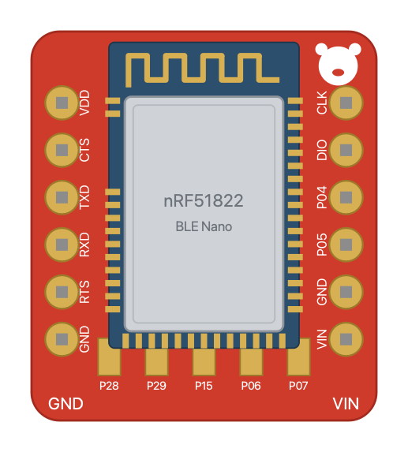
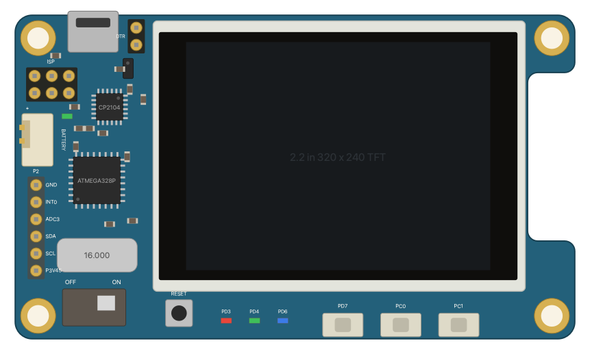

# fritzing-parts-extra

[Fritzing](https://fritzing.org) parts for boards that no parts library has,
drawn from their makers' published design files (gerbers, DXF outlines,
dimensioned drawings, schematics, datasheets) rather than traced by eye.
Each part has breadboard, schematic and PCB views.

| Part | Module id | |
|---|---|---|
| [RedBear BLE Nano v1.5](redbear-ble-nano-v1.5) | `RedBearBLENanoV1_5ModuleID` |  |
| [Hardkernel ODROID-SHOW2](odroid-show2) | `HardkernelOdroidShow2ModuleID` |  |

## Using them

**In the Fritzing app:** download a part's `.fzpz` from the
[releases](https://github.com/LeonFedotov/fritzing-parts-extra/releases) and
open it (File › Open); Fritzing adds it to the *Mine* bin. Or build them
yourself with `scripts/pack.sh` (into `dist/`).

**With [fritzing-render](https://github.com/LeonFedotov/fritzing-render):**
this repository is its `parts/` submodule, so the parts are in its CLI, MCP
server and Docker image. Elsewhere, add this folder to `FRITZING_PARTS`.

Each folder is an unpacked `.fzpz`: `part.<name>.fzp` beside its
`svg.<view>.<name>.svg` drawings, plus a README with the pinout and sources.

## How they're made

The generators in [`tools/`](tools) write each part from its sources, so a
part can be checked against them and rebuilt:

```sh
python3 -m venv .venv && .venv/bin/pip install gerbonara
.venv/bin/python tools/redbear_ble_nano_v1_5.py ~/code/nRF5x   # a redbear/nRF5x checkout
python3 tools/odroid_show2.py                                  # measurements are in the script
```

## Licence

[CC BY-SA 4.0](LICENSE). Product names, logos and trademarks belong to their
owners; the parts only depict the boards.
