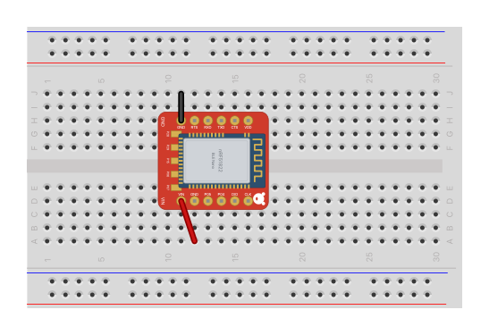

# RedBear BLE Nano v1.5

Nordic nRF51822 (Cortex-M0, Bluetooth Low Energy) on an 18.5 × 20.9 mm board.
Module id `RedBearBLENanoV1_5ModuleID`.

Two rows of six 0.1 in header pins, 0.6 in apart, so it straddles a
breadboard's centre gap like a wide DIP:

## Pins

The breadboard view shows the module side, as the board sits in a
breadboard. The real board prints pin labels only on its underside; they
are drawn on top here so the diagram reads. The five `P0_*` pads along the
bottom edge are on the underside, for soldering wires to.

| Connector | Name | What it is |
|---|---|---|
| `connector0` | `VDD` | 3.3 V rail: output when powered from VIN, or supply in (1.8 to 3.6 V) |
| `connector1` | `P0_10` | D2, UART CTS, SPI CS, I2C SDA |
| `connector2` | `P0_9` | D1, UART TXD, SPI MOSI |
| `connector3` | `P0_11` | D0, UART RXD, SPI MISO |
| `connector4` | `P0_8` | D3, UART RTS, SPI SCK, I2C SCL |
| `connector5` | `GND` | ground |
| `connector6` | `SWCLK` | SWD clock |
| `connector7` | `SWDIO` | SWD data |
| `connector8` | `P0_4` | A3, analog in |
| `connector9` | `P0_5` | A4, analog in |
| `connector10` | `GND` | ground |
| `connector11` | `VIN` | supply in, 3.3 to 13 V, through the on-board regulator |
| `connector12` | `P0_28` | D4, pad on the underside |
| `connector13` | `P0_29` | D5, pad on the underside |
| `connector14` | `P0_15` | D6, pad on the underside |
| `connector15` | `P0_6` | A5, analog in, pad on the underside |
| `connector16` | `P0_7` | D7, pad on the underside |

Arduino numbers (RedBear's core): D0 `P0_11`, D1 `P0_9`, D2 `P0_10`, D3 `P0_8`,
D4 `P0_28`, D5 `P0_29`, D6 `P0_15`, D7 `P0_7`, D13 `P0_19` (the on-board LED,
not on a pin), A3 `P0_4`, A4 `P0_5`, A5 `P0_6`. The UART functions are those of
the factory solder-jumper setting (S1–S5 shorted).

## Sources

Generated by [`tools/redbear_ble_nano_v1_5.py`](../tools/redbear_ble_nano_v1_5.py)
from RedBear's published design files in [redbear/nRF5x](https://github.com/redbear/nRF5x):

- `nRF51822/pcb/BLE Nano v1.5 gerber.zip`: the 12 header pads (1.8 mm, 0.9 mm
  holes), the underside's edge pads (1.2 × 2.0 mm) and the module's pad rows
- `nRF51822/docs/nRF51822 Nano V1.5.dxf`: the board outline
- `nRF51822/docs/images/ble_nano_pinout.png`, the bottom silkscreen and
  `arduino/.../pin_transform.cpp`: pin names and Arduino numbers

Breadboard, schematic and PCB views. The module (shield can, antenna) is
drawn from the footprint, not traced from a photo.
